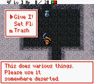
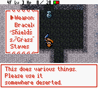
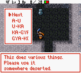
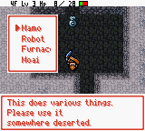

# Debug room / developer event menu

**The original developer event menu is accessible with GameShark code
`019F2FC1`. No debug build flag or ROM modification is required.** It opens over
the current dungeon floor; this access method does not warp to a separate room.

Verified on **2026-09-10** against the original Japanese ROM and the current
English shadowed-font build. This document records access, the supplied
reproduction state, menu meanings, and requirements for a future repair.
**The menu layout and translations have not been changed in this investigation.**

## Access

1. Make a separate save state and use a disposable save for experimentation.
2. Enable the Game Boy/Game Boy Color GameShark code `019F2FC1` during dungeon play.
3. Take a staircase and select **Proceed**.
4. Disable the code once **Give Item / Set Flag / Trash** appears.

The code repeatedly writes `$9F` to CPU WRAM address `$C12F`, the pending event ID.
The staircase transition then executes the developer event. Merely enabling it
while standing still does not open the menu. Keep the code enabled through the
transition: a one-time memory write can be overwritten before event dispatch.
The code is an event override, not a permanent debug-mode switch.

This RAM mapping is described in the GB2 section of
[sinsinpub's reverse-engineering notes](https://gist.github.com/sinsinpub/66c98292f0978016279df880224c577e#file-shiren_gb2_jpn-md).
The staircase route was independently reproduced here, including entry into the
submenus after disabling the cheat. No physical cheat cartridge was tested.

The current [`tools/build.py`](../tools/build.py) CLI has only the font-style
option in addition to its input/output arguments; it does not expose a debug flag.
Documentation referring to **Debug → Script Window** describes Mesen's own Lua
tools, which are separate from this original in-game menu.

## Supplied save state

[`SaveStates/debug-room.mss`](../SaveStates/debug-room.mss) is at the **Proceed /
Stay** prompt on **3F**, immediately before the transition. It is not already
inside the developer menu. Its inventory has all **20 slots occupied**.

In Mesen, load the state with the English ROM, enable `019F2FC1`, and press A on
Proceed. The developer menu opens on 4F. Disable the code there.

Although the state contains `$C12F=$9F`, loading it without enabling the cheat
and selecting Proceed leads to ordinary 4F gameplay. The native transition
overwrites the stored event byte with `$FF`.

The original capture is preserved unchanged. Its native PyBoy counterpart is
[`SaveStates/debug-room.state`](../SaveStates/debug-room.state):

| File | SHA-1 |
|---|---|
| `debug-room.mss` | `5906eb78869e505a724d65fc4cb2ac7844e07de8` |
| `debug-room.state` | `a2edb2034941b16fcc40b2b98a2e8b3a322d3099` |

Conversion used the existing sibling converter and verified Japanese ROM:

```sh
python3 ../mesen-to-pyboy/mss_to_pyboy.py SaveStates/debug-room.mss \
  --rom "Fushigi no Dungeon - Fuurai no Shiren GB2 - Sabaku no Majou (Japan).gbc" \
  --output-dir SaveStates --verify-frames 12
```

The converter validated the supported machine state and advanced the result for
12 frames. The subsequent menu investigation ran in disposable emulator sessions
with in-memory cartridge RAM, leaving the archived state and user's saves intact.

## Reading the current menus

These captures show the current defects, not a repaired layout:

| Main menu | Give Item categories |
|---|---|
|  |  |
| **Meat presets, page 1** | **Set Flag** |
|  |  |

Use Up/Down and A to select. B returns to the parent menu; in Meat pages 2 and 3
it returns to the preceding page. **Next** cycles Meat pages 1 → 2 → 3 → 1.

The following lists give the complete labels in visible top-to-bottom order,
even where the current screen clips or overlaps them.

### Main menu

| Option | Meaning / observed behavior |
|---|---|
| Give Item | Opens categories of predefined item batches. It is not an individual-item browser. |
| Set Flag | Runs one of four named event/progression presets; meanings are listed below. |
| Trash | Immediately removes every carried item, without a confirmation, then returns to the main debug menu. |

**Give Item does not replace a full inventory.** In the supplied state, choosing
Weapon 1 left the existing 20 item records unchanged. In a disposable copy,
using Trash first and then Weapon 1 produced the expected 20 weapons.
The counts below were measured with an empty inventory; do not assume that a
partially full inventory receives a complete batch.

### Give Item

| Category | Submenu options, in order | Items produced with empty inventory |
|---|---|---|
| Weapons/Shields | Weapon 1 / Weapon 2 / Shield 1 / Shield 2 | 20 / 13 / 20 / 9 |
| Bracelets/Grass | Bracelet 1 / Bracelet 2 / Grass | 20 / 7 / 20 |
| Scrolls/Staves | Scroll 1 / Scroll 2 / Staff 1 / Staff 2 | 20 / 14 / 20 / 6 |
| Pots/Arrows | Pot / Arrow | 16 / 7 |
| Meat | Three pages of monster-meat batches | See below |

These are native developer presets, including reserved item IDs and test values.
For example, the observed shield batches have +99 upgrades, Staves have 99 uses,
Pots have capacity 8, and Arrow entries have quantity 99. Their existence here
does not establish that an item or configuration is obtainable in ordinary play.

### Meat

Labels such as **A-U** and **KA-GYA** transliterate the original Japanese name
ranges. They are not English alphabetical filters. Each selection gives a fixed
batch; **Next** is the first option on every page.

The family names below use the current English catalog. Unless a subset is
specified, the batch includes the family's variants present in the native preset.

| Page | Current option | Count | Included families / special subsets |
|---|---|---:|---|
| 1 | A-U | 20 | Ironhead, Vampire Baron, Shady Wisp, Squid King, Dozy Genie, Healer Rabbit, Pitcher Plant |
| 1 | U-KA | 18 | Wolf Droid, Ether Devil, Mutaikon, Pop Tank, Wily Tanuki, Impact Boar |
| 1 | KA-GYA | 18 | Teaser Monkey, Crow Tengu, Daze Hermit, Skull Mage, Demon Warrior, Gyaza |
| 1 | GYA-KO | 18 | Gyadon, Fog Hermit, Twisty Hani, Alert Fly, Gazer, Punter Scarab; Boy Tank and Mini Tank |
| 2 | KO-JA | 18 | Goggler, Samuraidon, Zen Guru, Death Reaper, Schubell, Jungarian |
| 2 | JI-CHO | 20 | Rock Head, Sip Leech, Cell Armor, Taur, Dagyan, Lamp Puffer; Snacky and Chicken only |
| 2 | CHI-DO | 18 | Chintala, Baby Mage, Pot Fisher, Porky, Floor Dragon, Dragon |
| 2 | NI-BA | 18 | Nigiri Morph, Glare Snake, Minion Mouse, Curse Girl, Lobber Beetle, Explochin |
| 3 | BA-HYA | 18 | Bat Kangaroo, King Tusker, Pumphantasm, Sheep Priest, Bored Kappa, Gawkulus |
| 3 | PI-MA | 19 | Scurry Egg, Soldier Ant, Ghost Warrior, Doze Mage, Mamel; Bow Boy and Crossbow Boy; Master Chicken and Great Chicken |
| 3 | MI-WA | 18 | Slime, Mini Mixer, Morabi, Dark Vassal, Dark Slasher, Trap Genin |
| 3 | Evil Types | 6 | Bad Froggo and Bad Zalokleft |

### Set Flag

| Current option | Native action's translated result / verification |
|---|---|
| Mamo | Reports that Mamo can appear and asks the player to exit and reenter the facility. |
| Robot | Reports that **Zenmaiger** can appear and asks the player to exit and reenter the facility. The generic label hides the character's name. |
| Furnace | Reports that Mamo can appear and the **Blacksmith's Furnace** has opened. |
| Moai | Reports that **Big Moai has departed the town**. It changes several flag/state fields. It is not the minimal gift-code-screen unlock helper. |

These result messages and their immediate RAM effects were observed. The
downstream NPC routes were not played through in this investigation. The exact
meaning of every flag changed by these presets remains a separate tracing task.

For the narrow Big Moai gift-code-screen unlock, use the separately documented
[`mesen_unlock_big_moai.lua`](BIG_MOAI.md#safe-mesen-unlock-helper) route.
The debug Moai preset left the helper's `$C3EF-$C3F0` stage pair unchanged in this
fixture while changing other state, including `$C3EE` and `$C3E9-$C3ED`.

## What is translated, and what is broken

All **38 distinct choice labels** used by these ten menus already have English
overrides in [`script/en/ui_system.tsv`](../script/en/ui_system.tsv).
The 36 debug-specific labels are group 7 indices **197–232**, original stable
IDs `192:$7530` through `192:$75C7`. **Trash** (index 144, `192:$7131`) and **Next**
(index 159, `192:$7179`) are shared with ordinary game menus.

The introductory and flag-result messages are also translated: group 112
indices 48–52, stable IDs `200:$44C8`, `200:$44E3`, `200:$450B`, `200:$4536`,
and `200:$4559`. Their authoring owner is the prose editor.

No missing English override was found among these choices and messages. There
are still wording problems: the romanized Meat ranges, the generic Robot label,
and Moai's unspecified action. Translating arbitrary rows in `internal.tsv`
would not resolve these observed menus. The retained developer selectors in
groups 0, 13, and 14 are a separate inventory, not proof that event `$9F` uses them.
See [the internal-text boundary](internal-text-audit.md).

The generic popup has **five interior tiles**. The cursor consumes eight pixels,
leaving **32 pixels for each label**. Nine of the ten debug menus exceed that
budget. The choice records are native event opcode `$1E`, each 13 bytes long,
in **bank 180 decimal / `$B4` hexadecimal**:

| Menu | Original choice record | Widest label | Width | Minimum total frame columns¹ |
|---|---|---|---:|---:|
| Main | `180:$4A98` | Give Item | 46 px | 9 |
| Item categories | `180:$4AB2` | Bracelets/Grass | 78 px | 13 |
| Weapons/Shields | `180:$4AD7` | Weapon 1 | 40 px | 8 |
| Bracelets/Grass | `180:$4AF8` | Bracelet 1 | 49 px | 10 |
| Scrolls/Staves | `180:$4B15` | Scroll 1 | 38 px | 8 |
| Pots/Arrows | `180:$4B36` | Arrow | 27 px | 7 |
| Meat page 1 | `180:$4B4F` | KA-GYA / GYA-KO | 35 px | 8 |
| Meat page 2 | `180:$4B74` | JI-CHO / CHI-DO | 35 px | 8 |
| Meat page 3 | `180:$4B99` | Evil Types | 49 px | 10 |
| Set Flag | `180:$4BBE` | Furnace | 36 px | 8 |

¹ This is a text-width lower bound, **not a safe template specification**:
`ceil((8 + label_width) / 8) + 2`, including cursor and both borders.
It does not prove that the native text-tile allocation or cleanup can support
that width. The existing service extension supplies only 48 label pixels.

The item-category capture also shows text occupying other rows' cursor areas.
This investigation reproduced the corruption but has not yet traced every pixel
to its source tile. The existing six-tile-per-physical-row allocation described
in [`service_menus.py`](../tools/service_menus.py) makes simply extending the box
an unsafe assumption.

## Repair requirements: preserve ordinary gameplay

**Protecting the current main-game rendering takes precedence over improving
the debug menu.** No shared template, menu renderer, tile allocation, production
translation, or build option was changed for this documentation pass.

The implementation should follow these requirements before it is merged into
the normal build:

1. **Prove an exact debug-only entry condition.** Trace the active event and full
   choice-record set. Do not use `$C12F=$9F` alone: the cheat can hold that value
   while unrelated menus are active. Ordinary and unknown menus must retain
   their existing paths.
2. **Design and verify separate debug text/tile storage.** Trace the constructor,
   row stride, cursor cells, tile/attribute banks, and all exits before choosing
   geometry. Account for the 78-pixel category label and five-option menus.
   Do not widen the shared native template or assume the service-menu extension
   can be reused. Any new owned range requires guards and a ROM-bank-map entry.
3. **Keep wording changes scoped to actual debug consumers.** Preserve shared
   Trash/Next semantics. Review explicit action names for the flag presets and
   meaningful names for the twelve Meat batches, preserving their original
   membership. Add internal translations only for separately proven visible
   consumers, with a reviewed audit-policy change where needed.
4. **Test complete cursor and cleanup behavior in both fonts.** Replay all ten
   menus, every cursor position, the Meat-page cycle, B/back, item creation with
   full and empty inventories, flag-result messages, and main-menu exit. Check
   literal label and border pixels, unique cursor positions, both VRAM tile and
   attribute banks, and restoration after every width/height transition. Include
   repeated open/close cycles and a subsequent floor transition.
5. **Exercise ordinary menus before and after debug use.** Include Items, item
   actions, Status, stairs, Warehouse, Bank, Blacksmith, Rescue, and Training.
   Compare their raster/cursor/cleanup behavior with the current build and retain
   the existing stray-tile regressions. Test cold boot and save/resume as required
   by the changed paths. A clean screenshot inside the debug menu is insufficient.
6. **Complete the normal change gates.** Run the catalog owners for text edits,
   structural/width/internal audits, production builds, focused live routes, and
   the full suite for any ROM-layout or renderer patch. Perform visual acceptance
   in Mesen as well. See [ENGINEERING_RULES.md](ENGINEERING_RULES.md),
   [ROM_BANK_MAP.md](ROM_BANK_MAP.md), and [TRAPS.md](TRAPS.md).

This is a repair plan, not a claim that isolated storage, a safe renderer gate,
or a complete geometry fix has already been implemented.

## Reproduction and verification

[`tests/test_debug_room.py`](../tests/test_debug_room.py) freezes the supplied
native state's SHA-1 and exercises the original ROM. It verifies that a stored
event byte alone is insufficient, that the real GameShark code dispatches `$9F`,
that all ten menus and their Back routes work after removing the cheat, and that
full inventory, Trash, and Weapon 1 have the documented distinct effects.

These are access/behavior tests. They **do not certify a future English layout
repair**; the renderer-specific checks above must accompany that repair.

```sh
python3 -m unittest \
  tests.test_debug_room \
  tests.test_pyboy_state_fixtures \
  tests.test_menu_action_audit -v

python3 tools/menu_action_audit.py \
  "Fushigi no Dungeon - Fuurai no Shiren GB2 - Sabaku no Majou (Japan).gbc" \
  --translations script/en
```

On 2026-09-10, the focused run passed **16 tests**, without failures or skips.
The English investigation also navigated all ten menus, exercised all 25 item
batches with empty inventories, and observed all four flag-result messages.
Screenshots above came from the supplied state with the English shadowed-font
ROM SHA-1 `3838dd39959ef075dfaf5a4c30363db6579573c2`; the verified Japanese source
SHA-1 is `5264f6d0c4f12c9144de1d12fddadbadd82b3e33`.
