# Debug room / developer event menu

**The original developer event menu is accessible with GameShark code
`019F2FC1`. No debug build flag or ROM modification is required.** It opens over
the current dungeon floor; this access method does not warp to a separate room.

Access was verified on **2026-09-10** against the original Japanese ROM and the
English build. **Normal builds now install all ten accepted readable debug menus**
through [`tools/debug_menus.py`](../tools/debug_menus.py) and
[`tools/debug_menus.asm`](../tools/debug_menus.asm). The integration preserves the
accepted prototype's ROM bytes, exact runtime gates, cursor behavior and cleanup.
The access code is still needed; there is no extra build flag. See
[normal-build integration](#normal-build-integration) for local playtest artifacts
and validation, and the [prototype history](#isolated-debug-menu-prototype) for
layout and timing evidence.

**Final automated validation: 2026-09-11.** All ten layouts have user visual
acceptance. The integrated normal builds passed 711 tests and 41 additional
artifact checks with zero failures, errors or skips. See the
[final results](#final-validation-results) and
[ordinary-gameplay risk assessment](#risk-and-remaining-playtest-coverage).

## Access

1. Make a separate save state and use a disposable save for experimentation.
2. Enable the Game Boy/Game Boy Color GameShark code `019F2FC1` during dungeon play.
3. Take a staircase and select **Proceed**.
4. Disable the code once **Give Item / Set Flag / Trash** appears.

The code repeatedly writes `$9F` to CPU WRAM address `$C12F`, the pending event ID.
The staircase transition then executes the developer event. Merely enabling it
while standing still does not open the menu. Keep the code enabled through the
transition: a one-time memory write can be overwritten before event dispatch.
The code is an event override, not a permanent debug-mode switch.

This RAM mapping is described in the GB2 section of
[sinsinpub's reverse-engineering notes](https://gist.github.com/sinsinpub/66c98292f0978016279df880224c577e#file-shiren_gb2_jpn-md).
The staircase route was independently reproduced here, including entry into the
submenus after disabling the cheat. No physical cheat cartridge was tested.

The current [`tools/build.py`](../tools/build.py) CLI has only the font-style
option in addition to its input/output arguments; it does not expose a debug flag.
Documentation referring to **Debug → Script Window** describes Mesen's own Lua
tools, which are separate from this original in-game menu.

## Supplied save state

[`SaveStates/debug-room.mss`](../SaveStates/debug-room.mss) is at the **Proceed /
Stay** prompt on **3F**, immediately before the transition. It is not already
inside the developer menu. Its inventory has all **20 slots occupied**.

In Mesen, load the state with the English ROM, enable `019F2FC1`, and press A on
Proceed. The developer menu opens on 4F. Disable the code there.

Although the state contains `$C12F=$9F`, loading it without enabling the cheat
and selecting Proceed leads to ordinary 4F gameplay. The native transition
overwrites the stored event byte with `$FF`.

The capture also legitimately contains an **open English staircase popup**:
bank-5 `$D9F6-$D9F7` holds its armed `$53/$AC` cleanup marker. The saved added
column starts at BG `$991B`, with five tile/attribute pairs
`0D 03 / 1D 03 / 2B 02 / 39 02 / 0F 02`. The live column contains the widened
right border. Pressing B restores those exact pairs and clears both marker bytes
in the frozen baseline and repaired normal ROMs, in both fonts. This is intentional saved
popup state, not unrelated native data accidentally arming cleanup.
[`tests/fixtures/debug_room.json`](../tests/fixtures/debug_room.json) freezes its
hash, navigation state and underlay. The additional inventory-space capture below
has its own exact contract. All other fixtures still have to satisfy the existing
unarmed-marker guard.

The original capture is preserved unchanged. Its native PyBoy counterpart is
[`SaveStates/debug-room.state`](../SaveStates/debug-room.state):

| File | SHA-1 |
|---|---|
| `debug-room.mss` | `5906eb78869e505a724d65fc4cb2ac7844e07de8` |
| `debug-room.state` | `a2edb2034941b16fcc40b2b98a2e8b3a322d3099` |

Conversion used the existing sibling converter and verified Japanese ROM:

```sh
python3 ../mesen-to-pyboy/mss_to_pyboy.py SaveStates/debug-room.mss \
  --rom "Fushigi no Dungeon - Fuurai no Shiren GB2 - Sabaku no Majou (Japan).gbc" \
  --output-dir SaveStates --verify-frames 12
```

The converter validated the supported machine state and advanced the result for
12 frames. The subsequent menu investigation ran in disposable emulator sessions
with in-memory cartridge RAM, leaving the archived state and user's saves intact.

### Additional inventory-space capture

The supplied update is named
[`SaveStates/debug-room.state.mss`](../SaveStates/debug-room.state.mss). It is
also at the 3F Proceed/Stay prompt, with **10 occupied inventory slots and 10 free
slots**. It was saved with the experimental shadowed-font ROM. The original
20-item capture remains available for full-inventory rejection tests.

| File | SHA-1 |
|---|---|
| `debug-room.state.mss` | `a7d740c5f35cb95750ea4f0b26cc3088e6b3487d` |
| `debug-room.state.state` | `e153a6467b19d9c3dd1b44183b880551d237a385` |

The doubled `.state` suffix follows the converter's source-stem naming rule;
the user's source filename is preserved. Conversion used
`experiment-shadowed-font.gbc` and verified 12 frames. The new fixture freezes
the ten existing item records and slot order, the state digest, and its armed
stairs underlay at `$994F`. B/cancel must restore every saved tile/attribute
pair and clear the marker in both fonts and both baseline/repaired normal ROMs.

All **25 item presets in both fonts** have been replayed from this capture
against the frozen baselines. Every original item is preserved, the granted
records and inventory order match, and grants stop at the 20-item capacity.
Smaller presets add six, seven or nine items; larger presets fill the ten free
slots. Item creation exits the debug menu. Both complete VRAM banks match the
baseline immediately afterward and through Status → Items → item actions and
all return paths. The category gate is required to activate during each route.

This is retained in
`test_partial_inventory_presets_preserve_items_and_match_baseline_cleanup`.
The initial audit and its per-preset results are under
`build/debug-room-prototype/inventory-room/` (`check_grants.py` and
`grant-report.json`). No ROM bytes or translations changed for this fixture work.

## Reading the current menus

The captures below are **historical, before the repair**. They show the clipping
and overlap that prompted this work. The normal builds now show the
[accepted readable layouts](#isolated-debug-menu-prototype).

| Main menu | Give Item categories |
|---|---|
|  |  |
| **Meat presets, page 1** | **Set Flag** |
|  |  |

Use Up/Down and A to select. B returns to the parent menu; in Meat pages 2 and 3
it returns to the preceding page. **Next Page** cycles Meat pages 1 → 2 → 3 → 1.

The following lists describe the current labels and native actions. Older labels
are retained explicitly where they help identify the original presets.

### Main menu

| Option | Meaning / observed behavior |
|---|---|
| Give Item | Opens categories of predefined item batches. It is not an individual-item browser. |
| Set Flag | Runs one of four named event/progression presets; meanings are listed below. |
| Trash | Immediately removes every carried item, without a confirmation, then returns to the main debug menu. |

**Give Item does not replace a full inventory.** In the supplied state, choosing
Weapon 1 left the existing 20 item records unchanged. In a disposable copy,
using Trash first and then Weapon 1 produced the expected 20 weapons.
The counts below were measured with an empty inventory; do not assume that a
partially full inventory receives a complete batch.

### Give Item

| Category | Submenu options, in order | Items produced with empty inventory |
|---|---|---|
| Weapons/Shields | Weapon 1 / Weapon 2 / Shield 1 / Shield 2 | 20 / 13 / 20 / 9 |
| Bracelets/Grass | Bracelet 1 / Bracelet 2 / Grass | 20 / 7 / 20 |
| Scrolls/Staves | Scroll 1 / Scroll 2 / Staff 1 / Staff 2 | 20 / 14 / 20 / 6 |
| Pots/Arrows | Pot / Arrow | 16 / 7 |
| Meat | Three pages of monster-meat batches | See below |

These are native developer presets, including reserved item IDs and test values.
For example, the observed shield batches have +99 upgrades, Staves have 99 uses,
Pots have capacity 8, and Arrow entries have quantity 99. Their existence here
does not establish that an item or configuration is obtainable in ordinary play.

### Meat

The old labels such as **A-U** and **KA-GYA** transliterate Japanese name ranges.
The normal build replaces these with numbered batches and native item counts.
Each selection gives a fixed batch; **Next Page** is the first option on every
page. The original catalog's shared **Next** label remains unchanged.

The family names below use the current English catalog. Unless a subset is
specified, the batch includes the family's variants present in the native preset.

| Page | Normal-build option | Before-repair label | Included families / special subsets |
|---|---|---|---|
| 1 | Batch 1 (20) | A-U | Ironhead, Vampire Baron, Shady Wisp, Squid King, Dozy Genie, Pitcher Plant; Healer Rabbit and Life Rabbit only |
| 1 | Batch 2 (18) | U-KA | Wolf Droid, Ether Devil, Mutaikon, Pop Tank, Wily Tanuki, Impact Boar |
| 1 | Batch 3 (18) | KA-GYA | Teaser Monkey, Crow Tengu, Daze Hermit, Skull Mage, Demon Warrior, Gyaza |
| 1 | Batch 4 (18) | GYA-KO | Gyadon, Fog Hermit, Twisty Hani only, Alert Fly, Gazer, Punter Scarab; Boy Tank and Mini Tank |
| 2 | Batch 5 (18) | KO-JA | Goggler, Samuraidon, Zen Guru, Death Reaper, Schubell, Jungarian |
| 2 | Batch 6 (20) | JI-CHO | Rock Head, Sip Leech, Cell Armor, Taur, Dagyan, Lamp Puffer; Snacky and Chicken only |
| 2 | Batch 7 (18) | CHI-DO | Chintala, Baby Mage, Pot Fisher, Porky, Floor Dragon, Dragon |
| 2 | Batch 8 (18) | NI-BA | Nigiri Morph, Glare Snake, Minion Mouse, Curse Girl, Lobber Beetle, Explochin |
| 3 | Batch 9 (18) | BA-HYA | Bat Kangaroo, King Tusker, Pumphantasm, Sheep Priest, Bored Kappa, Gawkulus |
| 3 | Batch 10 (19) | PI-MA | Scurry Egg, Soldier Ant, Ghost Warrior, Doze Mage, Mamel; Bow Boy and Crossbow Boy; Master Chicken and Great Chicken |
| 3 | Batch 11 (18) | MI-WA | Slime, Mini Mixer, Morabi, Dark Vassal, Dark Slasher, Trap Genin |
| 3 | Batch 12 (6) | Evil Types | Bad Froggo and Bad Zalokleft |

### First Meat page

The first page uses **Next Page**, **Batch 1 (20)**, **Batch 2 (18)**,
**Batch 3 (18)** and **Batch 4 (18)**. Counts describe the full native preset in
an empty inventory. Existing items are preserved, and only the remaining slots
are filled, in the order below. These are fixed batches, not alphabetical filters.
The menu artwork alone changes; native actions and production/shared labels do not.

| Normal-build label | Original label | Native action |
|---|---|---|
| Batch 1 (20) | A-U | `180:$4F48` |
| Batch 2 (18) | U-KA | `180:$4F88` |
| Batch 3 (18) | KA-GYA | `180:$4FC2` |
| Batch 4 (18) | GYA-KO | `180:$4FFC` |

Exact English contents, in grant order:

- **Batch 1 (20)**: Ironhead; Chainhead; Gigahead; Vampire Baron; Vampire Duke; Vampire Tyrant; Shady Wisp; Fearful Wisp; Wailing Wisp; Squid King; Squid Lord; Squid Emperor; Dozy Genie; Groggy Genie; Sleepy Genie; Healer Rabbit; Life Rabbit; Pitcher Plant; Identify Plant; Blessing Plant.
- **Batch 2 (18)**: Wolf Droid; Gorilla Bot; Bear Borg; Ether Devil; Phantom Devil; Mirage Devil; Mutaikon; Dazikon; Dozikon; Pop Tank; Grampa Tank; Ornery Tank; Wily Tanuki; Tricky Tanuki; Crafty Tanuki; Impact Boar; Crash Boar; Wrecker Boar.
- **Batch 3 (18)**: Teaser Monkey; Derider Monkey; Mocker Monkey; Crow Tengu; Falcon Tengu; Eagle Tengu; Daze Hermit; Scold Hermit; Spry Hermit; Skull Mage; Skull Wizard; Skull Wraith; Demon Warrior; Hannya Warrior; Shogun; Gyaza; Killer Gyaza; Hell Gyaza.
- **Batch 4 (18)**: Gyadon; Gyairas; Gyandora; Fog Hermit; Haze Hermit; Mist Hermit; Twisty Hani; Alert Fly; Fink Fly; Nark Fly; Gazer; Super Gazer; Hyper Gazer; Punter Scarab; Striker Scarab; Kicker Scarab; Boy Tank; Mini Tank.

The frozen [batch fixture](../tests/fixtures/debug_meat_page_1.json) records each
native monster ID and tier. Its test compares the original `1D monster tier`
grant stream and translated monster names, then verifies every resulting item
record against the production ROM in both fonts. The trace is archived at
`build/debug-room-prototype/meat-page-1/native-trace.json`.

### Second Meat page

Choose **Give Item → Meat → Next Page**. Page 2 continues with **Batch 5 (18)**,
**Batch 6 (20)**, **Batch 7 (18)** and **Batch 8 (18)**. Counts again assume an
empty inventory; existing items are preserved and free slots fill in grant order.
**Next Page** opens the third repaired page. B returns to the first repaired page.

| Normal-build label | Original label | Native action |
|---|---|---|
| Batch 5 (18) | KO-JA | `180:$5036` |
| Batch 6 (20) | JI-CHO | `180:$5070` |
| Batch 7 (18) | CHI-DO | `180:$50B0` |
| Batch 8 (18) | NI-BA | `180:$50EA` |

Exact English contents, in grant order:

- **Batch 5 (18)**: Goggler; Worth Goggler; Glenn Goggler; Samuraidon; Taishodon; Tonosamadon; Zen Guru; Zen Monk; Zen Priest; Death Reaper; Hell Reaper; Grim Reaper; Schubell; Menbell; Bellthoven; Jungarian; Campbellan; Blackbelly.
- **Batch 6 (20)**: Rock Head; Ogre Rock; Demon Rock; Sip Leech; Slurp Leech; Gulp Leech; Cell Armor; Chrome Armor; Titanium Armor; Taur; Minotaur; Megataur; Snacky; Dagyan; Dagyagan; Dagyagyagan; Chicken; Lamp Puffer; Lantern Puffer; Beacon Puffer.
- **Batch 7 (18)**: Chintala; Mid Chintala; Big Chintala; Baby Mage; Boy Mage; Brat Mage; Pot Fisher; Pot Angler; Pot Giller; Porky; Porko; Porkon; Floor Dragon; Dragon Head; Tunnel Dragon; Dragon; Sky Dragon; Archdragon.
- **Batch 8 (18)**: Nigiri Morph; Nigiri Boss; Nigiri Master; Glare Snake; Leer Snake; Ogle Snake; Minion Mouse; Mobster Mouse; Skipper Mouse; Curse Girl; Curse Sister; Curse Mom; Lobber Beetle; Heaver Beetle; Slinger Beetle; Explochin; Concusschin; Fulminachin.

Batch 6 deliberately includes only Snacky and Chicken from that family, in their
native positions among the other grants. The [page 2 fixture](../tests/fixtures/debug_meat_page_2.json)
freezes every monster ID, tier and name. Tests compare the native grant opcodes,
live empty/full inventory results, and immediate controller cleanup in both fonts.
The independent trace is `build/debug-room-prototype/meat-page-2/native-trace.json`.

### Third Meat page

Choose **Give Item → Meat**, then **Next Page** twice. The final page contains
**Batch 9 (18)**, **Batch 10 (19)**, **Batch 11 (18)** and **Batch 12 (6)**.
**Next Page** cycles back to page 1; B returns to page 2. Counts describe empty
inventory grants; existing items stay in place and only free slots are filled.

| Normal-build label | Original label | Native action |
|---|---|---|
| Batch 9 (18) | BA-HYA | `180:$5124` |
| Batch 10 (19) | PI-MA | `180:$515E` |
| Batch 11 (18) | MI-WA | `180:$519B` |
| Batch 12 (6) | Evil Types | `180:$51D5` |

Exact English contents, in grant order:

- **Batch 9 (18)**: Bat Kangaroo; Evil Kangaroo; Devil Kangaroo; King Tusker; Monarch Tusker; Emperor Tusker; Pumphantasm; Pumphantom; Pumpanshee; Sheep Priest; Goat Pastor; Gazelle Pope; Bored Kappa; Kappa Pest; Vexing Kappa; Gawkulus; Lockulus; Hawkulus.
- **Batch 10 (19)**: Scurry Egg; Scamper Egg; Leaping Egg; Soldier Ant; Captain Ant; General Ant; Bow Boy; Crossbow Boy; Ghost Warrior; Ghost Hannya; Ghost Shogun; Master Chicken; Great Chicken; Doze Mage; Sleep Warlock; Slumber Wizard; Mamel; Pit Mamel; Cave Mamel.
- **Batch 11 (18)**: Slime; Grime; Ooze; Mini Mixer; Mini Mixermon; Mini Mixergon; Morabi; Warabi; Takabi; Dark Vassal; Demon Vassal; Sable Vassal; Dark Slasher; Sneaky Slasher; Shadow Slasher; Trap Genin; Trap Chunin; Trap Jonin.
- **Batch 12 (6)**: Bad Froggo; Bad Froggucci; Bad Froggon; Bad Zalokleft; Gang Zalokleft; Mob Zalokleft.

Batch 10 includes Bow Boy/Crossbow Boy and Master Chicken/Great Chicken, with
no other variants of those families. Batch 12 preserves the six native **Evil Types**
grants: the Bad Froggo and Bad Zalokleft families. The numbered label changes
only private artwork; native actions and production catalog strings stay unchanged.

The [page 3 fixture](../tests/fixtures/debug_meat_page_3.json) freezes every
monster ID, tier, name and native grant address. Its regression checks the original
opcodes and resulting item records with both empty and full inventories. The live
trace is `build/debug-room-prototype/meat-page-3/native-trace.json`.

### Set Flag

| Normal-build option | Before-repair label | Native action's translated result / verification |
|---|---|---|
| Enable Mamo | Mamo | Reports that Mamo can appear and asks the player to exit and reenter the facility. |
| Enable Zenmaiger | Robot | Reports that **Zenmaiger** can appear and asks the player to exit and reenter the facility. |
| Open Furnace | Furnace | Reports that Mamo can appear and the **Blacksmith's Furnace** has opened. |
| Moai Leaves | Moai | Reports that **Big Moai has departed the town**. It changes several flag/state fields. It is not the minimal gift-code-screen unlock helper. |

These result messages and their immediate RAM effects were observed. The
downstream NPC routes were not played through in this investigation. The exact
meaning of every flag changed by these presets remains a separate tracing task.

The normal build uses the following clearer private labels. It runs the
same event bytes, keeps the result messages unchanged and changes no progression
logic. The tracked [flag fixture](../tests/fixtures/debug_flags.json) records the
opcode operands and the observed immediate state. Native flag bits are stored
in the 32-byte array `$C3CE-$C3ED`: flag `n` is bit `n % 8` of byte `n // 8`.
All flag numbers in this table are hexadecimal.

| Private label | Native event action | Immediate operation |
|---|---|---|
| Enable Mamo | `180:$4BDF` | Clear flag `$00`; set `$3E,$3F`. |
| Enable Zenmaiger | `180:$4BE9` | Set `$41,$42`. |
| Open Furnace | `180:$4BF1` | Clear `$00`; set `$3E,$3F,$3B,$3C`. Also enables Mamo, as its message explains. |
| Moai Leaves | `180:$4BFF` | Write `$1E` to `$C3EE`; clear `$96-$DB`; set `$DC-$F9` and `$4A`. |

The original result selectors remain group 112, indices 49–52. On both supplied
fixtures, Enable Zenmaiger leaves these bytes unchanged because its bits are
already set. Regression tests also use all-clear and all-set disposable flag
arrays to verify each set/clear operation. They compare the entire flag array,
`$C3EE`, the unchanged `$C3EF-$C3F0` pair, inventory, immediate controller returns,
and both complete VRAM banks at the native result-page boundary and after exit.
The page boundary matters: a fixed delay can sample different phases of the
native blinking prompt after the two menu layouts take different times to close.
No changed bit is assigned a downstream story meaning beyond the native result
messages without a separately played route.

For the narrow Big Moai gift-code-screen unlock, use the separately documented
[`mesen_unlock_big_moai.lua`](BIG_MOAI.md#safe-mesen-unlock-helper) route.
The debug Moai preset left the helper's `$C3EF-$C3F0` stage pair unchanged in this
fixture while changing other state, including `$C3EE` and `$C3E9-$C3ED`.

## Translation coverage and original layout limitations

All **38 distinct choice labels** used by these ten menus already have English
overrides in [`script/en/ui_system.tsv`](../script/en/ui_system.tsv).
The 36 debug-specific labels are group 7 indices **197–232**, original stable
IDs `192:$7530` through `192:$75C7`. **Trash** (index 144, `192:$7131`) and **Next**
(index 159, `192:$7179`) are shared with ordinary game menus.

The introductory and flag-result messages are also translated: group 112
indices 48–52, stable IDs `200:$44C8`, `200:$44E3`, `200:$450B`, `200:$4536`,
and `200:$4559`. Their authoring owner is the prose editor.

No missing English override was found among these choices and messages. The
romanized Meat ranges, generic Robot label and unspecified Moai action were
clarified through private debug artwork. Their catalog strings and the shared
Trash/Next labels were preserved. No edit to `internal.tsv` was needed. The retained developer selectors in
groups 0, 13, and 14 are a separate inventory, not proof that event `$9F` uses them.
See [the internal-text boundary](internal-text-audit.md).

The original generic popup has **five interior tiles**. The cursor consumes eight pixels,
leaving **32 pixels for each label**. Before repair, nine of the ten debug menus exceeded
that budget. This table records the original limitation, not the final frame sizes.
The choice records are native event opcode `$1E`, each 13 bytes long,
in **bank 180 decimal / `$B4` hexadecimal**:

| Menu | Original choice record | Widest label | Width | Minimum total frame columns¹ |
|---|---|---|---:|---:|
| Main | `180:$4A98` | Give Item | 46 px | 9 |
| Item categories | `180:$4AB2` | Bracelets/Grass | 78 px | 13 |
| Weapons/Shields | `180:$4AD7` | Weapon 1 | 40 px | 8 |
| Bracelets/Grass | `180:$4AF8` | Bracelet 1 | 49 px | 10 |
| Scrolls/Staves | `180:$4B15` | Scroll 1 | 38 px | 8 |
| Pots/Arrows | `180:$4B36` | Arrow | 27 px | 7 |
| Meat page 1 | `180:$4B4F` | KA-GYA / GYA-KO | 35 px | 8 |
| Meat page 2 | `180:$4B74` | JI-CHO / CHI-DO | 35 px | 8 |
| Meat page 3 | `180:$4B99` | Evil Types | 49 px | 10 |
| Set Flag | `180:$4BBE` | Furnace | 36 px | 8 |

¹ This is a text-width lower bound, **not a safe template specification**:
`ceil((8 + label_width) / 8) + 2`, including cursor and both borders.
It does not prove that the native text-tile allocation or cleanup can support
that width. The existing service extension supplies only 48 label pixels.

The before-repair item-category capture shows text occupying other rows' cursor areas.
Tracing confirms the six-tile-per-physical-row allocation described in
[`service_menus.py`](../tools/service_menus.py): extending the map alone would
expose aliases into other rows. The overflowing native category renderer also
damaged its border bitmap at the end of the popup pool. The completed repair
handles both the row aliases and the border tile explicitly.

## Repair requirements: preserve ordinary gameplay

**Protecting the current main-game rendering takes precedence over improving
the debug menu.** No shared template, menu renderer, tile allocation, production
translation, or build option was changed for the original documentation pass.

The repair was developed against these requirements:

1. **Prove an exact debug-only entry condition.** Trace the active event and full
   choice-record set. Do not use `$C12F=$9F` alone: the cheat can hold that value
   while unrelated menus are active. Ordinary and unknown menus must retain
   their existing paths.
2. **Design and verify separate debug text/tile storage.** Trace the constructor,
   row stride, cursor cells, tile/attribute banks, and all exits before choosing
   geometry. Account for the 78-pixel category label and five-option menus.
   Do not widen the shared native template or assume the service-menu extension
   can be reused. Any new owned range requires guards and a ROM-bank-map entry.
3. **Keep wording changes scoped to actual debug consumers.** Preserve shared
   Trash/Next semantics. Review explicit action names for the flag presets and
   meaningful names for the twelve Meat batches, preserving their original
   membership. Add internal translations only for separately proven visible
   consumers, with a reviewed audit-policy change where needed.
4. **Test complete cursor and cleanup behavior in both fonts.** Replay all ten
   menus, every cursor position, the Meat-page cycle, B/back, item creation with
   full and empty inventories, flag-result messages, and main-menu exit. Check
   literal label and border pixels, unique cursor positions, both VRAM tile and
   attribute banks, and restoration after every width/height transition. Include
   repeated open/close cycles and a subsequent floor transition.
5. **Exercise ordinary menus before and after debug use.** Include Items, item
   actions, Status, stairs, Warehouse, Bank, Blacksmith, Rescue, and Training.
   Compare their raster/cursor/cleanup behavior with the current build and retain
   the existing stray-tile regressions. Test cold boot and save/resume as required
   by the changed paths. A clean screenshot inside the debug menu is insufficient.
6. **Complete the normal change gates.** Run the catalog owners for text edits,
   structural/width/internal audits, production builds, focused live routes, and
   the full suite for any ROM-layout or renderer patch. Perform visual acceptance
   in Mesen as well. See [ENGINEERING_RULES.md](ENGINEERING_RULES.md),
   [ROM_BANK_MAP.md](ROM_BANK_MAP.md), and [TRAPS.md](TRAPS.md).

All ten layouts below have been accepted in user testing. At the user's request,
the same runtime is now integrated into the normal build for local
playtesting. The full tree followed by floor changes and save/resume remains manual
acceptance work; integration does not claim that exhaustive matrix is complete.

## Normal-build integration

`build.py` installs `debug_menus` after the existing presentation patches in both
font variants. The canonical installer owns only 5:`$58E6-$58ED` and
254:`$5000-$7EFF`, plus cartridge checksum updates. No runtime algorithm, geometry,
VRAM or WRAM reservation changed during integration. Native item grants,
progression scripts, encounter data, shared templates and text catalogs retain
their accepted bytes.

The installer replaces the prototype's whole-ROM allowlist with guards on the
exact native controller, constructor, navigation, border, layout, graph, debug
choice records, installed English glyphs and empty reservation. This permits
normal translation builds, including the partial-translation build fixture,
while rejecting changed dependencies or collisions. The historical adapter keeps
its additional frozen-ROM guard for reproducing earlier comparisons.

### Final validation results

The final automated run completed on **2026-09-11**. The local preparation is
recorded under `build/debug-menu-release/`. Both normal
ROMs are byte-for-byte identical to the accepted ten-menu experiments:

| Font | Normal-build SHA-1 |
|---|---|
| Classic | `7329b1e9cd7c0b51b54f5cbc471985083f3da4af` |
| Shadowed | `bd4fdae48457ea6a0297de6d4f6dc0253b149e7e` |

| Check | Final result | Evidence under `build/debug-menu-release/` |
|---|---|---|
| Complete discovered suite | **711 tests in 1,270.352 seconds**, including all 20 debug regressions; zero failures, errors or skips | `test-results.json`, `logs/full-tests.log` |
| Exact-artifact emulator battery | **41 checks in 36.144 seconds**; zero failures, errors or skips | `battery-results.json`, `logs/artifact-battery.log` |
| Text, layout, graphics and rescue validators | All nine passed | `validation-results.json` |
| Standalone browser checks | All four passed with Node available | `javascript-results.json` |
| Fresh source rebuild | Both ROMs and both IPS files reproduced byte-for-byte from an isolated 479-file working-tree copy | `clean-build-results.json` |
| Artifact integrity | Valid cartridge checksums and IPS reconstruction; exact accepted-prototype ROM bytes | `artifact-integrity.json`, `roms/SHA256SUMS.txt` |
| Preserved inputs | Verified Japanese ROM and all 73 archived save-related files unchanged | `artifact-integrity.json`, `saved-input-sha256.json` |

The exact-artifact battery covers cold boot, all 34 archived PyBoy states in each
font, all four classic/shadowed SRAM save/reload combinations, diary names, Rescue,
Training, equipment, combat borders, Monster Log, ending credits and Blank Scroll.
These general save tests are separate from an exhaustive save/reload matrix after
every debug-menu route.

The accepted prototype also passed **77,560 Mesen navigation frames** across both
fonts and both supplied saves, covering all forty cursor positions. Its comparison
page contains **1,760 opening/closing frames**. This is the earlier
[prototype evidence](#prototype-validation-results), retained because normal-build
integration produced identical ROM bytes; it is not an additional Mesen rerun.

The integration refreshed the build fixture's output hashes/checksums and the
font-variant artwork ownership contract. The workbench catalogue was regenerated
through its owner: only three revision fields changed, with all 6,695 records
identical. The final suite above passed after these updates; earlier incomplete
runs are not the final acceptance result.

The verified ROMs are installed at
`build/shiren-gb2-english-{classic,shadowed}-font.gbc`, with local IPS files beside
them and identical copies under `build/debug-menu-release/roms/`. Previous normal
artifacts are backed up in `build/debug-menu-release/before/normal-artifacts/`.
The preparation manifest is `build/debug-menu-release/verification.json`;
[testing-and-build.md](testing-and-build.md#debug-menu-normal-build-playtest)
records the wider release checks. No patch was published as part of this
preparation. Automated acceptance is complete for the recorded checks; full
manual playthrough acceptance remains open.

### Risk and remaining playtest coverage

**Ordinary players who do not use debug have low residual risk from this change,
not a guarantee of zero risk.** This is an engineering assessment based on patch
scope and observed tests, not a measured failure probability.

The shared event-choice entry at 5:`$58E6` now runs a small dispatch check.
The widened renderer and its restoration routines require the exact debug event,
script position and complete choice record. Ordinary choices fall back to their
existing controller; nonzero temporary scratch also selects that fallback.
Because that entry check is shared, the ordinary game is not
entirely untouched; no regressions were found in the tested ordinary routes.

Combat rules, encounters, native item grants and progression scripts are unchanged.
The repair leaves shared menu templates intact, saves and restores every covered
background tile and attribute, preserves text tiles during cursor movement, and
clears its temporary WRAM before returning. There is no new SRAM allocation or
save-format change. Unknown interactions remain possible on routes not exercised.

The main remaining rendering uncertainty is an unusual transition after debug
use. Automated coverage includes repeated size changes, map-edge wrapping, both
VRAM banks, interrupt-sensitive copying and returns to ordinary menus. It does
not prove every subsequent floor, scene or save/reload sequence.

Manual acceptance still includes:

- A full ordinary playthrough, including floor changes, Items/Status and save/resume.
- Closing the complete debug tree, then exercising floor changes and save/reload
  in both fonts; not every combination has been covered.
- Downstream NPC/story routes after each Set Flag preset. Immediate flag effects
  and result pages are tested, but those longer progression routes remain open.

**Set Flag intentionally changes story progression**, and Trash removes inventory.
These are native developer actions preserved by the repair. Judge ordinary story
progression with a save that has not had the flag presets applied; use separate
copies when testing those presets. Disable `019F2FC1` after the debug root appears
so it does not keep overriding later events.

## Isolated debug menu prototype

[`tools/debug_room_prototype.py`](../tools/debug_room_prototype.py) produces a
**separate experimental ROM** from one of the two reviewed English baselines.
It is retained as a historical adapter; `build.py` now imports the canonical
`debug_menus` installer directly. The following describes the accepted runtime,
now shared by normal builds and this adapter. All three Meat pages privately use
**Next Page** and numbered batches with native item counts. Set Flag privately
uses **Enable Mamo**, **Enable Zenmaiger**, **Open Furnace** and **Moai Leaves**;
other labels retain their full current English wording. Shared **Next** and
all production catalog strings remain unchanged.

| Menu | Frame | Label area after cursor | Static text/cursor tiles |
|---|---|---|---|
| Give Item / Set Flag / Trash | 9×7 tiles, 72×56 pixels | 48 px; widest label 46 px | 17/48 |
| Give Item categories | 13×11 tiles, 104×88 pixels | 80 px; widest label 78 px | 40/48 |
| Weapons/Shields presets | 8×9 tiles, 64×72 pixels | 40 px; widest label 40 px | 14/48 |
| Bracelets/Grass presets | 10×7 tiles, 80×56 pixels | 56 px; widest label 49 px | 12/48 classic; 14/48 shadowed |
| Scrolls/Staves presets | 8×9 tiles, 64×72 pixels | 40 px; widest label 38 px | 15/48 in both fonts |
| Pots/Arrows presets | 7×5 tiles, 56×40 pixels | 32 px; widest label 27 px | 8/48 in both fonts |
| Meat page 1 | 11×11 tiles, 88×88 pixels | 64 px; widest label 57 px | 23/48 classic; 24/48 shadowed |
| Meat page 2 | 11×11 tiles, 88×88 pixels | 64 px; widest label 57 px | 23/48 classic; 24/48 shadowed |
| Meat page 3 | 11×11 tiles, 88×88 pixels | 64 px; widest label 62 px | 25/48 classic; 26/48 shadowed |
| Set Flag | 13×9 tiles, 104×72 pixels | 80 px; widest label 80 px | 30/48 in both fonts |

All ten layouts use an 8-pixel cursor cell and 8-pixel text rows at a 16-pixel
pitch. The separate 49th border tile is explicitly reloaded. They reuse the same
native popup tile pool, with no additional gameplay graphics tiles or shared
template changes.

| Classic experiment (Mesen) | Shadowed experiment (Mesen) |
|---|---|
| 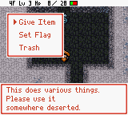 | 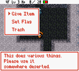 |
| 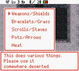 | 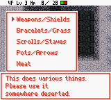 |
| 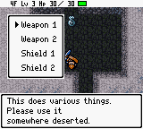 | 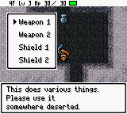 |
|  | 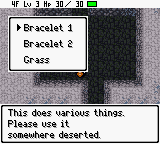 |
| 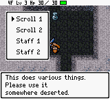 | 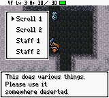 |
| 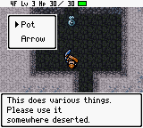 | 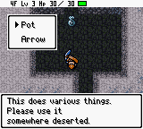 |
|  |  |
| 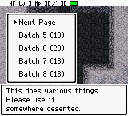 | 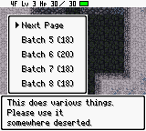 |
| 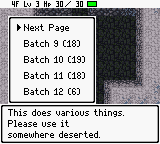 | 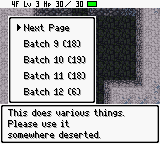 |
| 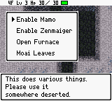 | 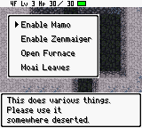 |

The gate at 5:`$58E6` checks all of:

- dungeon mode (`$C12B` bit 0 clear);
- active event/script identity `$C3B4-$C3B7 = 9F B4 92 4A`;
- next script position `$C3BE-$C3BF = A5 4A` for the main record, `BF 4A`
  for categories, `E4 4A` for Weapons/Shields, `05 4B` for Bracelets/Grass,
  `22 4B` for Scrolls/Staves, `43 4B` for Pots/Arrows, `5C 4B` for Meat page 1, `81 4B` for Meat page 2, `A6 4B` for Meat page 3, or `CB 4B` for Set Flag;
- all twelve bytes of the corresponding count, flags and choice record in
  `$FFB0-$FFBB`, including both three-choice records' four zero padding bytes and
  all three four-choice records' two zero padding bytes, plus Pots/Arrows' six;
- an entirely zero temporary WRAM slice before borrowing it.

Every mismatch calls the original controller. The pending event byte `$C12F`
is not a gate. The cloned controller retains native input, repeat/wrap, sounds,
selection values, event playback and final cleanup calls. A private painter
uploads the selected artwork once when opening. Navigation retains native cursor
edits in the WRAM bitmap cache, suppresses their VRAM upload, and changes only
the old/new cursor tilemap cells together during VBlank. Label tiles remain
unchanged throughout movement. It snapshots **every covered BG cell, including
attributes**: 63 for the main menu, 143 for categories, 72 for Weapons/Shields,
70 for Bracelets/Grass, 72 for Scrolls/Staves, 35 for Pots/Arrows, 121 for each Meat page and 117 for Set Flag.
It restores the entire
saved background before replacing the visible artwork with native cached tiles,
then performs native dungeon redraw. Map arithmetic wraps at both edges. The
temporary state is cleared before returning to the event interpreter.

The exact records are:

```text
main:      03 40 C5 07 E4 07 90 07 00 00 00 00
category:  05 40 C6 07 C7 07 C8 07 C9 07 CA 07
weapons:   04 40 CB 07 CC 07 CD 07 CE 07 00 00
bracelets: 03 40 CF 07 D0 07 D1 07 00 00 00 00
scrolls:   04 40 D2 07 D3 07 D4 07 D5 07 00 00
pots:      02 40 D6 07 D7 07 00 00 00 00 00 00
meat1:     05 40 9F 07 D8 07 D9 07 DA 07 DB 07
meat2:     05 40 9F 07 DC 07 DD 07 DE 07 DF 07
meat3:     05 40 9F 07 E0 07 E1 07 E2 07 E3 07
flags:     04 40 E5 07 E6 07 E7 07 E8 07 00 00
```

Bracelets/Grass, Scrolls/Staves and Pots/Arrows qualify only at `$4B05`, `$4B22`
and `$4B43` respectively.
The gate does not admit the whole `$4Bxx` page or select a layout by option count.
Main and Bracelets/Grass both have three choices; Weapons/Shields, Scrolls/Staves and Set Flag
all have four. Each has its own complete record and artwork selection. The
Scrolls/Staves choice begins at `180:$4B15`; `$4B22` is the next script position
observed at the controller call, after the choice record has been consumed.
Likewise, Pots/Arrows starts at `180:$4B36` and reaches the gate at `$4B43`.
Meat page 1 starts at `180:$4B4F` and qualifies only at `$4B5C`. Page 2 starts at
`180:$4B74` and qualifies only at `$4B81` with its own complete record. Page 3 starts
at `180:$4B99` and qualifies only at `$4BA6` with its own complete record and artwork. Next cycles 1 → 2 → 3 → 1; B returns 3 → 2
→ 1 → categories. Every outgoing frame is fully retired before the next page appears.
Set Flag begins at `180:$4BBE` and qualifies only at `$4BCB`; B returns to the
main menu, while A runs the original selected preset and its result message.

A private clone of the native constructor prepares its original text, bitmap
cache and template without displaying the cramped native map. This prevents
transient clipped text before the private frame appears. Map writes use a
private copier that rechecks LCD access after disabling interrupts; the shared
copier and original constructor remain unchanged.

Exact ROM/WRAM/VRAM ownership and the deliberate popup-bank reservation are in
[ROM_BANK_MAP.md](ROM_BANK_MAP.md). The production installer guards each native
dependency and the empty reservation. Only the historical audition adapter also
requires an approved whole-ROM digest; changed native dependencies require review.

Weapons/Shields artwork occupies `254:$6000-$639F`; Bracelets/Grass occupies
`254:$6400-$679B`; Scrolls/Staves occupies `254:$6800-$6B9F`. The final five
artwork blocks are packed consecutively, removing padding while retaining every
existing menu's complete 49-tile payload and frame bytes:

| Artwork | Bank 254 range |
|---|---|
| Pots/Arrows | `$6BA0-$6EF5` |
| Meat page 1 | `$6EF6-$72F7` |
| Meat page 2 | `$72F8-$76F9` |
| Meat page 3 | `$76FA-$7AFB` |
| Set Flag | `$7AFC-$7EF5` |

The exact-zero-guarded reservation stays `$5000-$7EFF`. No additional WRAM or
VRAM is borrowed. The existing cleanup and cursor algorithms serve all ten
exactly gated layouts. The event identity and first nine choice constants remain
at `$5140-$51AF`; the Set Flag record occupies `$51F0-$51FB`. Geometry occupies
`$51B0-$51E9`, with explicit 13×9 selection for kind 9. The unchanged toroidal
map-stepping helpers move to `$55D0-$55E7`, after the hidden constructor and its
layout table. This keeps the other helpers below `$5500` without changing their
algorithms. The cloned controller, gate, constructor and cached navigation retain
their fixed entry addresses. Assembler bounds and the full reservation guard
prevent overlap.

Build the normal ROMs and run the focused regressions:

```sh
python3 tools/build.py \
  "Fushigi no Dungeon - Fuurai no Shiren GB2 - Sabaku no Majou (Japan).gbc" \
  script/en build/shiren-gb2-english.gbc --font-style both

python3 -m unittest tests.test_debug_room_prototype -v
```

To reproduce the historical comparison, retain the two archived
`baseline-{classic,shadowed}-font.gbc` files in `build/debug-room-prototype/` with
the frozen hashes below; a new normal build already contains the repair and is
not a pre-integration baseline. Then run:

```sh
python3 tools/audit_debug_room_prototype.py build/debug-room-prototype \
  --mesen /Applications/Mesen.app/Contents/MacOS/Mesen
```

The historical audit command creates `experiment-classic-font.gbc` and
`experiment-shadowed-font.gbc` in that directory, along with `comparison.html`,
screenshots and `report.json`. Omit `--mesen` for PyBoy-only captures. The Mesen
run uses a private portable directory and the archived source state, leaving
the user's normal emulator configuration and cartridge saves alone.
The comparison page includes 40-frame sequences for main → category, category →
Weapons/Shields, Weapons/Shields → category, category → Bracelets/Grass,
Bracelets/Grass → category, category → Scrolls/Staves, Scrolls/Staves → category,
category → Pots/Arrows, Pots/Arrows → category, category → Meat page 1,
Meat page 1 → page 2, page 2 → page 3, page 3 → page 1, a repeat cycle to page 3,
page 3 → page 2, page 2 → page 1,
Meat page 1 → category, category → main, main → Set Flag, Set Flag → main
and main → gameplay,
with a slider and slow playback. It also retains the
earlier Down-press comparison when the archived frames are available in
`cursor-motion/`.

Load either normal font ROM with the supplied debug-room state, use the same
cheat/staircase route, and choose **Set Flag**. All ten repaired menus
should be readable, Up/Down should move one cursor without flashing text, and B
should return through categories and the main menu to gameplay without leftover frame
cells. After replacing an older ROM, re-enter from either supplied
staircase state.

The twenty focused regressions (retaining the historical module name) now build
the normal ROMs and reconstruct the frozen pre-integration comparison ROMs only
inside the test harness. They cover literal full-frame label/border/cursor pixels in
both fonts, all forty cursor positions and wraparound, all five submenu branches,
15 repeated submenu round trips per font, scratch bounds, every mismatched gate
byte for each menu, and horizontal/vertical BG-map wraps. They compare both complete VRAM
banks after cleanup, and capture each controller return before another screen can
redraw. Repeated changes among all ten menus and seven sizes check every vacated map cell; Set Flag,
Trash and B exits retain their native behavior. A transition regression requires
the saved background to be visible before both initial artwork upload and
subsequent native-cache restoration. The partial-inventory fixture checks all 25
presets, preservation of existing items and successful creation/exit paths.
All four Weapons/Shields, all three Bracelets/Grass, all four Scrolls/Staves,
both Pots/Arrows presets and all twelve Meat batches also run with empty and full inventories in both
fonts, comparing inventory order, item records and immediate controller returns
against the frozen pre-integration ROM. The Meat fixtures additionally freeze every
monster ID, tier and English name and check each native grant opcode. Repeated
three-page cycles and B returns check each complete private raster, every
unowned VRAM byte, and the native controller/VRAM state at every immediate
return. Exiting all pages must restore full VRAM and clear the private scratch.
Ordinary Status, Items, item actions and Floor are exercised
after debug use; Warehouse, Bank, Blacksmith Info, Rescue and Training are replayed
from their own fixtures with the normal ROM. Idle actor animation can shift
because the private drawing takes more time, so post-debug ordinary-menu checks
compare all BG graphics/maps/attributes rather than requiring the same OBJ phase.
Mesen separately matches all forty cursor rasters against PyBoy and checks
**2,340 main-menu, 4,810 category, 1,420 Weapons/Shields, 1,220 Bracelets/Grass,
1,420 Scrolls/Staves, 1,020 Pots/Arrows, 2,040 Meat page 1, 1,960 Meat page 2, 1,720 Meat page 3 and 1,440 Set Flag frames per font**, including repeated
returns between all ten menus and seven frame sizes.

The same native route also passes from the user's inventory-space Mesen capture,
`SaveStates/debug-room.state.mss`, in both fonts: another 38,780 displayed frames.
Its reference images come from the matching converted state because its normal
black UI palette differs from the older low-health capture's red palette. Every
menu pixel is compared using the capture's own palette. The Weapons/Shields,
Bracelets/Grass, Scrolls/Staves, Pots/Arrows, all three Meat-page and Set Flag screenshots above use this
inventory-space capture. The replay script and results are
`build/debug-room-prototype/set-flag/check_inventory_mesen.py` and
`inventory-mesen.json`; its full logs are `mesen-inventory-{classic,shadowed}.log`
in the prototype output directory. Both source captures remain unchanged.

| Font | Frozen pre-integration SHA-1 | Accepted experimental / normal-build SHA-1 |
|---|---|---|
| Classic | `afca7145d4e68bfc2f1a762196b53a7df0072dc7` | `7329b1e9cd7c0b51b54f5cbc471985083f3da4af` |
| Shadowed | `3838dd39959ef075dfaf5a4c30363db6579573c2` | `bd4fdae48457ea6a0297de6d4f6dc0253b149e7e` |

### Next acceptance step

All ten layouts have user visual acceptance and are integrated for local testing.
Play the normal game using the prepared ROM, including floor changes, Items,
Status and save/resume. When using debug, disable the access cheat once the root
menu appears, close the tree completely, then exercise the same ordinary routes.
The automated layout/action checks and general save battery do not certify every
post-debug floor/save combination.
See [risk and remaining playtest coverage](#risk-and-remaining-playtest-coverage)
for the distinction between ordinary gameplay and intentional flag-preset effects.

### Cursor-motion repair

The first prototype called the original cursor renderer on every Up/Down input
and then repainted the entire widened menu. That renderer still used the native
row geometry, so it briefly wrote into the new shared label tiles. The following
full repaint hid the corruption in settled screenshots while flashing text and
a misplaced cursor remained visible during movement. Frame 1 after Down changed
40 non-cursor pixels in classic and 47 in shadowed.

The repair stays inside the accepted debug reservation. It copies the
reviewed native input and cursor-coordinate routines into bank 254, retaining
their repeat, wrap, sound and cached-bitmap behavior. Its private glyph wrapper
uses `$C4DA=$05`: the compositor's existing bit-2 mode suppresses VRAM uploads
while preserving native cached cursor edits. No shared renderer is patched.
After a selection changes, a short VBlank update erases the previous cursor cell
and sets the new cell with interrupts disabled around the two writes. There is
no label, tile-pool or attribute upload during navigation.

The regression reproduces the old failure in both fonts, then checks every frame
of taps, held directions, wraparound and rapid reversals: **456 main-menu,
520 category, 488 Weapons/Shields, 456 Bracelets/Grass, 488 Scrolls/Staves,
424 Pots/Arrows, 520 for each Meat page and 488 Set Flag frames per font**,
each matching an independently constructed
complete menu raster. It also requires the entire 49-tile pool to remain
byte-identical. Mesen independently passes **38,780 checked frames across both
fonts** from the original capture, including held directions and repeated returns.
The later inventory-space capture brings the final total to **77,560 frames**.
During the prototype phase the pre-integration normal ROMs were unchanged; the
current normal builds have the accepted repaired ROM hashes listed above.

Evidence: `build/debug-room-prototype/cursor-motion/` contains the before/after
frames and focused regression logs; `report.json` and `mesen-*.log` in its parent
record the native-emulator checks. Refresh `comparison.html` to step through the
before/after movement.

The regressions also compare controller returns before the event interpreter can
redraw another menu. Selection/navigation state, stack pointer, WRAM/VRAM banks,
render mode, the native bitmap cache and both complete VRAM banks match the
baseline through repeated main/category/submenu exits and both inventory cases.

### Transition ordering and VRAM timing

Restoring native glyph tiles while the private map still referenced them briefly
turned shared label tiles into duplicated arrows. The background now retires
first. Likewise, the original narrow map must remain hidden while native text
is prepared; only the finished private artwork is exposed. The transition test
fails against the earlier ROM and checks both ordering rules at their actual
upload points. Frame captures under `set-flag/` make the progressive draw and
clear visible for inspection.

Mesen also exposed an interrupt race in the native map copier at `0:$0AEA`.
On a later main-menu reopen, the bottom-left corner write at BG `$9A08` occurred
on scanline 103, PPU cycles 231 and 249, while VRAM was locked. The subsequent
status check was already in HBlank, so the native retry missed the dropped cell.
The private copier checks the display state again after disabling interrupts
and writes the tile/attribute pair within a bounded interval. This change is
confined to the private debug controller; the shared copier is untouched.

The forced-scroll wrap test injects scroll at construction, after the gate's
scratch scan, and uses the pre-construction background as its map reference.
An earlier gate-entry injection can be undone by the camera IRQ before construction.
The injection also checks the exact script position, since main and Bracelets/Grass
share a three-choice count, Weapons/Shields, Scrolls/Staves and Set Flag share four,
and categories and all three Meat pages share five,
but each menu must be wrapped independently.
Native construction rereads scroll after drawing, by which time the
camera can have restored its normal origin; that native map is not a valid
reference for the deliberately wrapped rectangle. Native glyph preparation
still compares against the baseline, and both complete VRAM banks must match
after final cleanup.

### Prototype validation results

The ten-menu prototype passed complete discovery: **711 tests in
1273.838 seconds**, with **no failures, errors or skips**. This includes all
20 prototype regressions, the two inventory fixtures, all four progression
presets, ordinary menu/cleanup coverage, title transitions and the browser codec
check. Supply the installed Node runtime so the browser test runs:

```sh
ELECTRON_RUN_AS_NODE=1 \
SHIREN_NODE="/Applications/Visual Studio Code.app/Contents/MacOS/Code" \
python3 -m unittest discover -s tests -v
```

The complete log and artifact/hash record are
`build/debug-room-prototype/set-flag/full-tests.log` and `verification.json` in
the same directory. The focused run rebuilt both fonts and passed all 20 tests
in 124.391 seconds. It checks 4,880 navigation frames per font and 64
opening/restoration ordering pairs per font. The four Set Flag actions run in
both fonts from both captures, with original, all-clear and all-set progression
flags: 48 action cases with native effects, result selectors and cleanup intact.

Mesen passed **77,560 displayed navigation frames** across both fonts and both
native saves, covering all forty cursor positions, all ten menus and seven frame
sizes. Each font/save combination supplies 104 captured checkpoints. Results are
in `build/debug-room-prototype/report.json`, the native replay's
`set-flag/inventory-mesen.json`, and the four `mesen-*.log` files. The comparison
page provides **1,760 opening/closing frames** with a slider and slow playback.
`set-flag/packing-verification.json` records byte-identical artwork for all nine
earlier menus and the two relocated map-stepping routines.

At the time of this prototype run, both normal ROM hashes matched the frozen
pre-integration baselines. All four archived
`debug-room` files are unchanged: the original and inventory-space Mesen captures
and their converted PyBoy states. Their exact armed staircase underlays retain
live cancellation checks. The builder and catalogs were unchanged in that run.
These are historical prototype results. The normal-build integration above keeps
the accepted experimental ROMs byte-identical, so their Mesen rendering evidence
still applies; the new build and release regression results are recorded separately.

## Reproduction and verification

[`tests/test_debug_room.py`](../tests/test_debug_room.py) freezes the supplied
native state's SHA-1 and exercises the original ROM. It verifies that a stored
event byte alone is insufficient, that the real GameShark code dispatches `$9F`,
that all ten menus and their Back routes work after removing the cheat, and that
full inventory, Trash, and Weapon 1 have the documented distinct effects.

These are original-game access/behavior tests. The repaired layouts are covered
by `tests.test_debug_room_prototype`, which now runs the normal builds, and the
[final validation results](#final-validation-results) above.

```sh
python3 -m unittest \
  tests.test_debug_room \
  tests.test_pyboy_state_fixtures \
  tests.test_menu_action_audit -v

python3 tools/menu_action_audit.py \
  "Fushigi no Dungeon - Fuurai no Shiren GB2 - Sabaku no Majou (Japan).gbc" \
  --translations script/en
```

On 2026-09-10, the focused run passed **16 tests**, without failures or skips.
The English investigation also navigated all ten menus, exercised all 25 item
batches with empty inventories, and observed all four flag-result messages.
The historical before-repair screenshots came from the supplied state with the English shadowed-font
ROM SHA-1 `3838dd39959ef075dfaf5a4c30363db6579573c2`; the verified Japanese source
SHA-1 is `5264f6d0c4f12c9144de1d12fddadbadd82b3e33`.
